# Facebook Clone  <a href="url">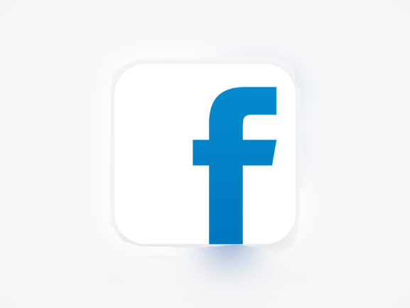</a>

**Welcome to the Facebook Clone UI Project!** 🎉  
This project serves as an exciting learning experience in building a user-friendly interface inspired by Facebook. It showcases the powerful capabilities of Flutter in creating beautiful and responsive UIs.

## **Technologies & Packages** 💻

- **Bloc** ✨: A powerful state management library for Flutter.
- **Localizations** 👌: Offering multilingual support for a global audience.
- **FontAwesomeIcons** 🎶: Beautiful icons to enhance the UI experience.
- **Animated Bottom NavBar** 😎: Engaging navigation that adds a dynamic feel to the app.

## Features 🪶

- **Dark Mode**: A sleek, modern look that’s easy on the eyes at night. 🌙
- **Light Mode**: A bright and vibrant design for daytime browsing. ☀️
- **Arabic Language Support**: Connect with Arabic-speaking users seamlessly. 🇸🇦
- **English Language Support**: Cater to a global audience with ease. 🇬🇧

### Note:
This project is primarily focused on the UI and testing Flutter's powerful capabilities. While it may not include backend functionalities, it lays the groundwork for future development and showcases how to create responsive layouts and interactive components. 

## Screenshots 📸

### Home Page (Dark Mode)

   <a href="url">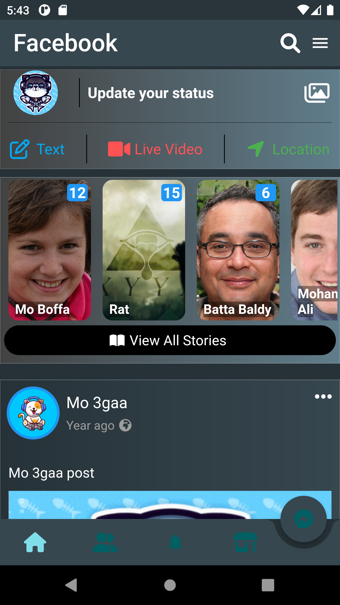</a>

### App Drawer (Dark Mode)

   <a href="url">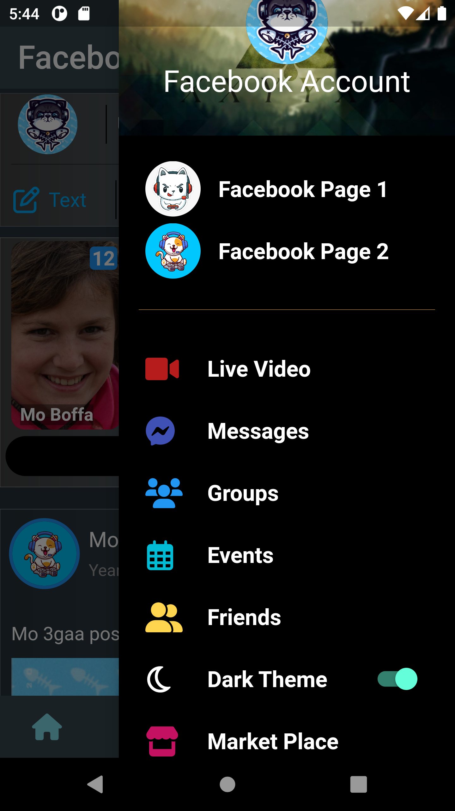</a>

### App Drawer (Light Mode)

   <a href="url">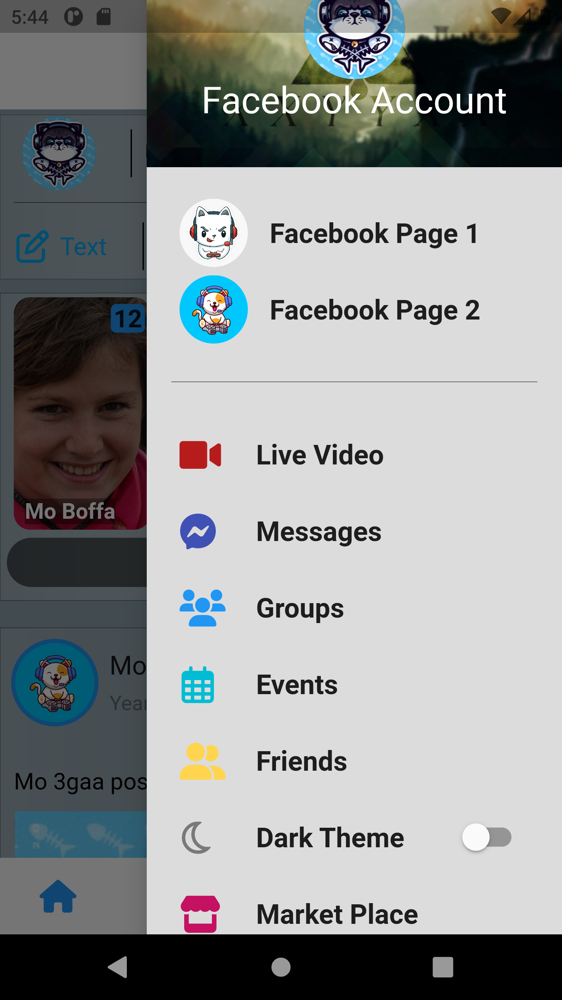</a>

### Home Page (Light Mode)

   <a href="url">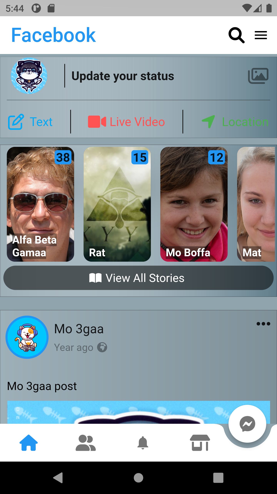</a>

### Friends Page (Light Mode)

   <a href="url">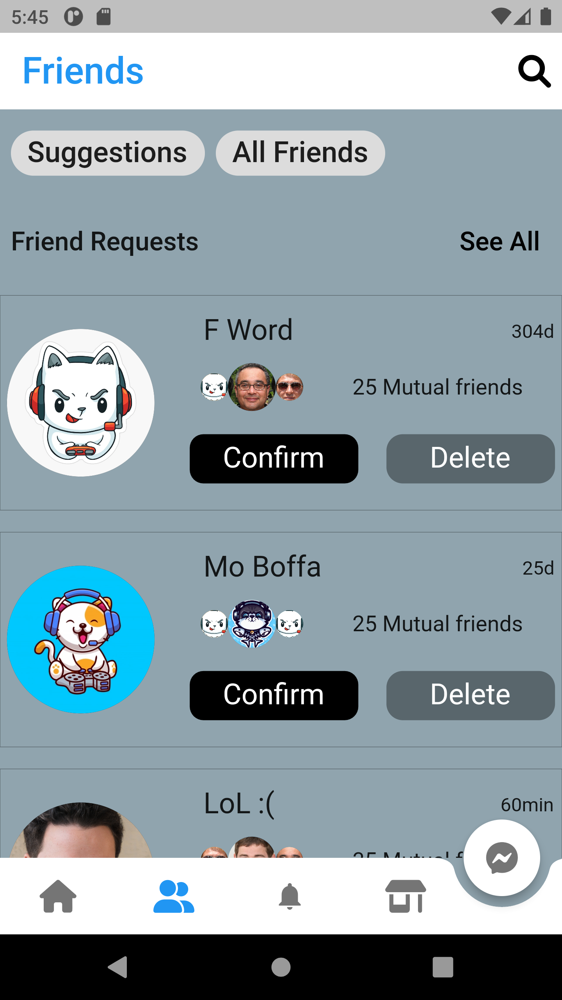</a>

### Notifications Page (Dark Mode)

   <a href="url">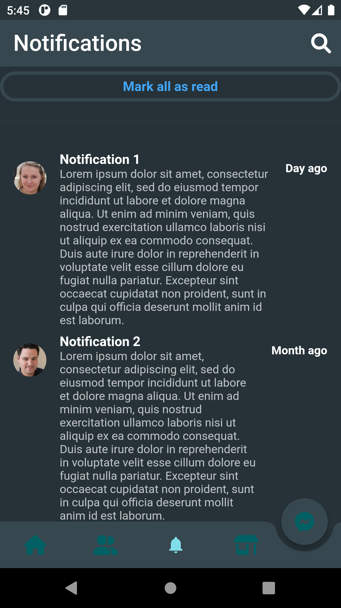</a>

### Market Page (Light Mode)

   <a href="url">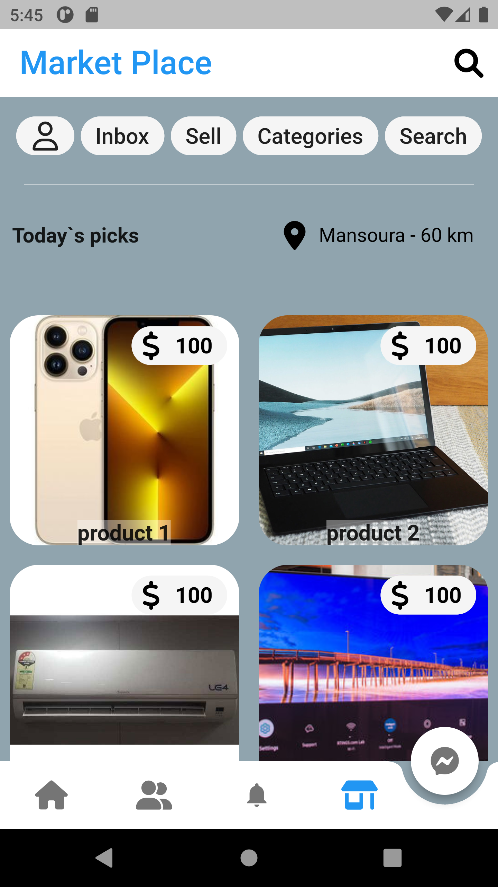</a>

### Message Page (Light Mode)

   <a href="url">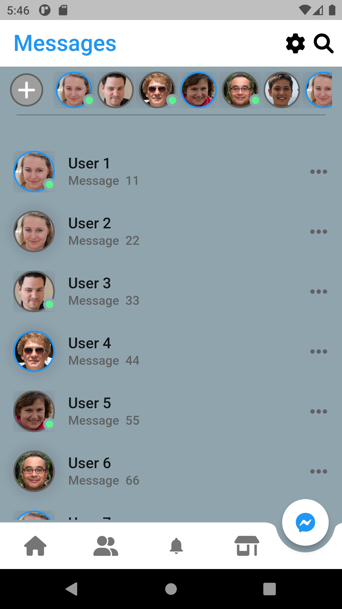</a>

### Change Language (English)

   <a href="url">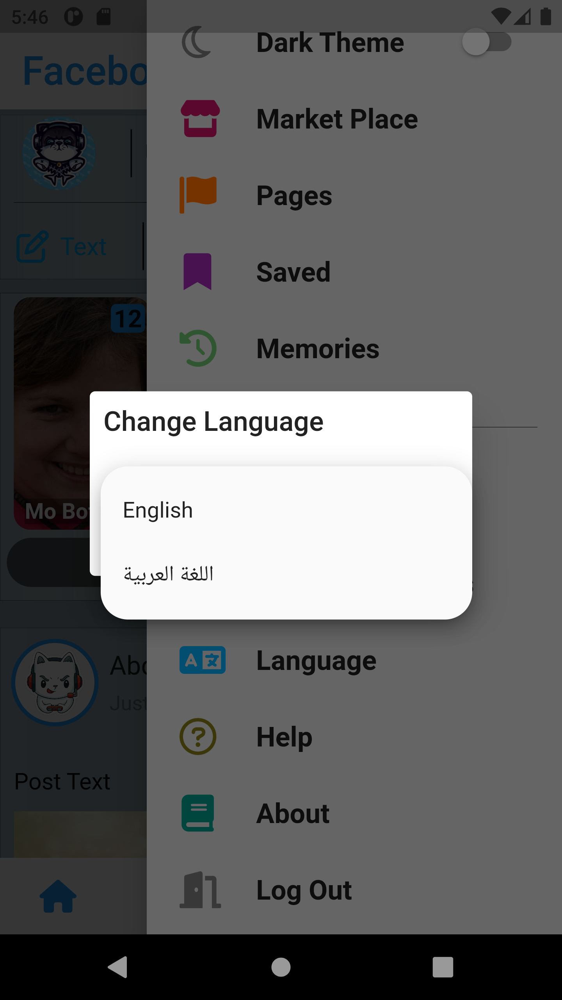</a>

### Change Language (Arabic)

   <a href="url">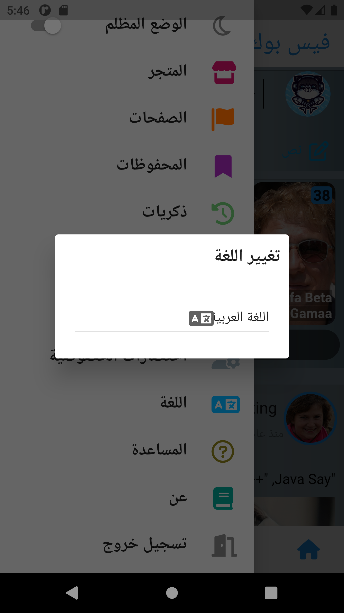</a>

### Home Page (Arabic)

   <a href="url">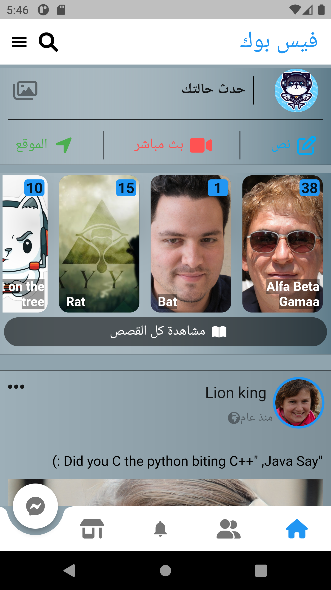</a>

### Friends Page (Arabic)

   <a href="url">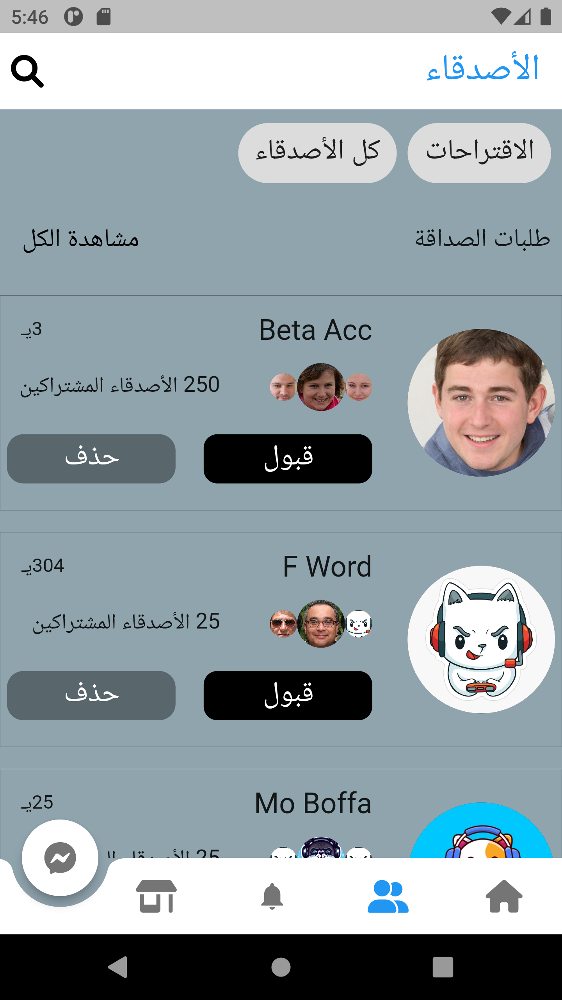</a>

### Market Page (Arabic)

   <a href="url">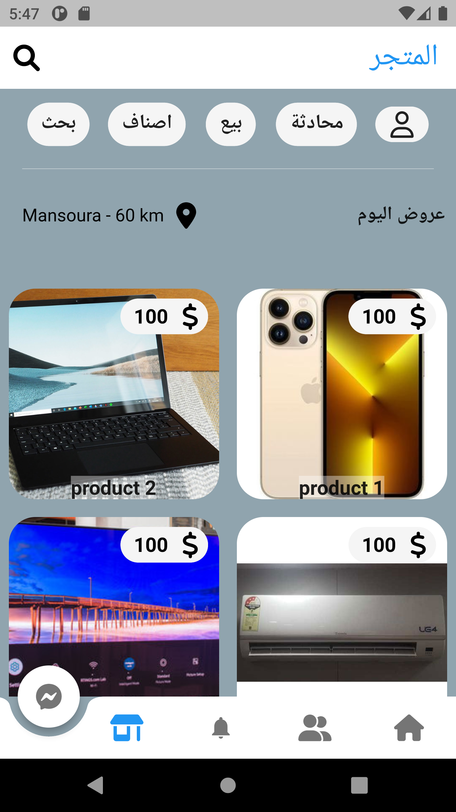</a>

